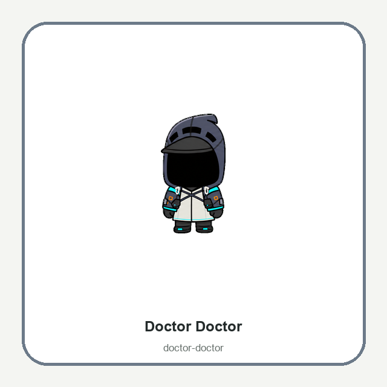
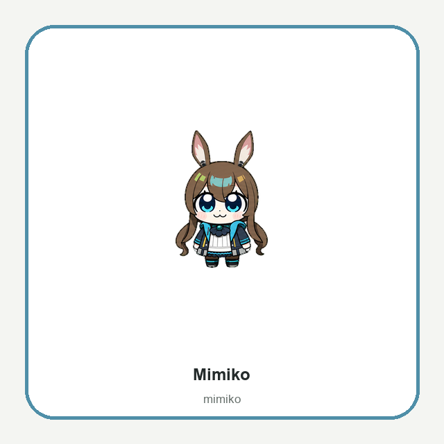
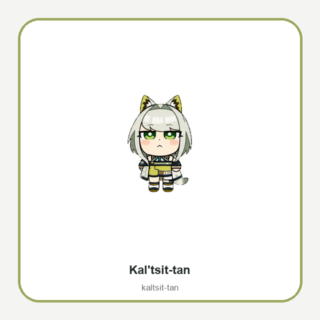
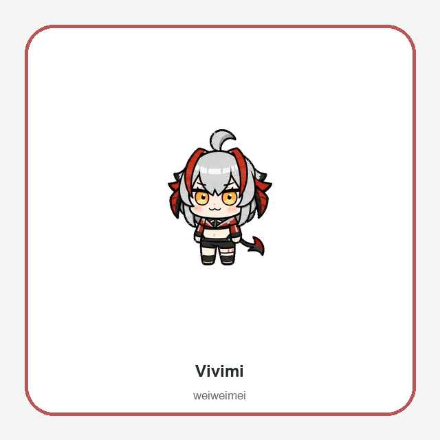
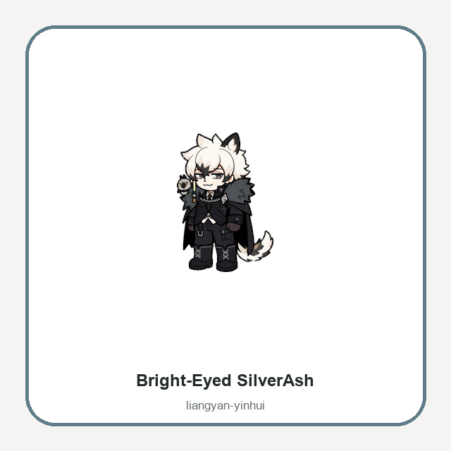
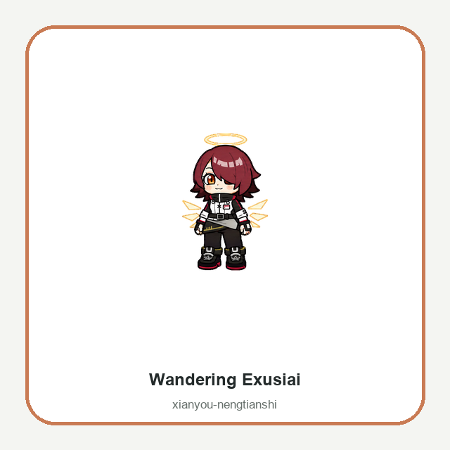
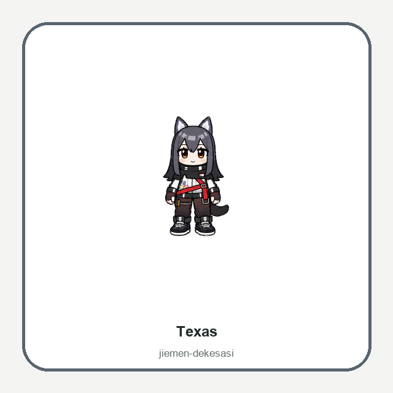

# Seven Arknights-Inspired Animated Codex Pets — Free V2 Pack

I made a collection of seven animated desktop companions for the Codex app, inspired by the playful Arknights April Fools character designs.


The complete pack is free on GitHub:

**https://github.com/WangGroupFDU/arknights-codex-pets**

## What is included?

The first release contains:

1. Doctor Doctor
2. Mimiko
3. Kal'tsit-tan
4. Vivimi
5. Bright-Eyed SilverAsh
6. Wandering Exusiai
7. Texas

Each character is a complete Codex V2 pet rather than a single static image. Every package includes nine standard desktop states—idle, movement, wave, jump, failed, waiting, working, and review—plus sixteen clockwise look directions.

## Character previews

### Doctor Doctor



### Mimiko



### Kal'tsit-tan



### Vivimi



### Bright-Eyed SilverAsh



### Wandering Exusiai



### Texas



## How to install

Download the all-in-one ZIP from the GitHub release page, extract it, and run the installer:

### macOS or Linux

```bash
chmod +x install.sh
./install.sh
```

### Windows PowerShell

```powershell
Set-ExecutionPolicy -Scope Process Bypass
.\install.ps1
```

You can also install a single character manually by copying its folder from `pets/` into your Codex pets directory:

- macOS/Linux: `~/.codex/pets/`
- Windows: `%USERPROFILE%\.codex\pets\`

Keep `pet.json` and `spritesheet.webp` together, then fully restart Codex.

## Technical details

All seven pets use the Codex V2 sprite contract:

- `spriteVersionNumber: 2`
- `1536 × 2288` RGBA WebP atlas
- `8 × 11` grid
- `192 × 208` cells
- Nine standard animation rows
- Sixteen look directions

Every atlas was checked with the Hatch Pet V2 validator. The GitHub repository includes the machine-readable validation reports and full contact-sheet previews.

## Creation workflow

The sprites were created with an AI-assisted OpenAI Codex ImageGen and Hatch Pet V2 workflow. The process used character reference sheets, generated coherent animation strips, assembled them deterministically into the Codex atlas layout, removed chroma spill, and validated the final transparent assets.

## Download and documentation

GitHub repository:

**https://github.com/WangGroupFDU/arknights-codex-pets**

Latest release:

**https://github.com/WangGroupFDU/arknights-codex-pets/releases/latest**

The English README contains complete installation instructions, troubleshooting, individual package IDs, and full animation previews.

## Disclaimer

This is an unofficial, non-commercial fan project. Arknights and all related characters and original designs belong to Hypergryph and their respective publishers. This project is not affiliated with or endorsed by Hypergryph, Yostar, OpenAI, or the Codex team.

