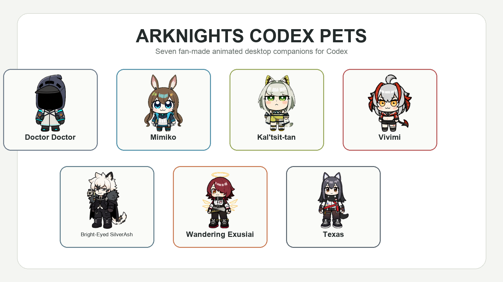
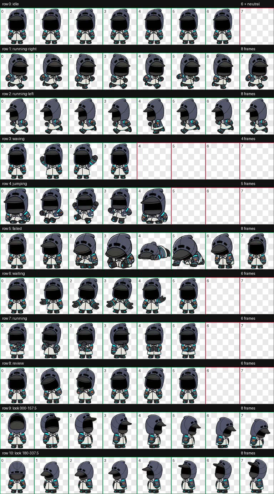
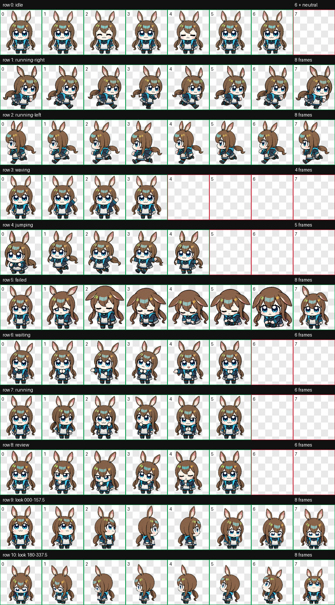
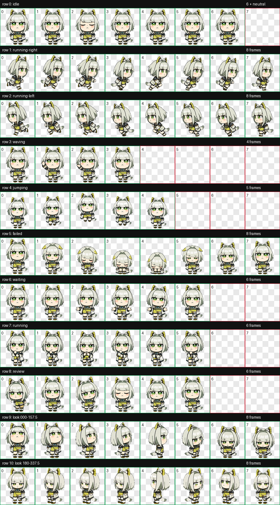
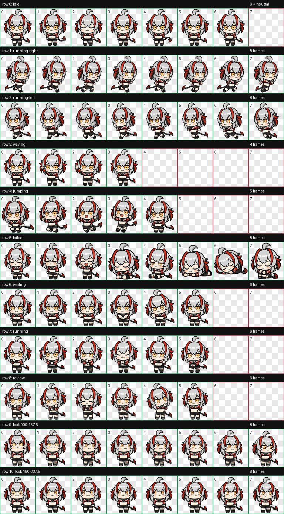
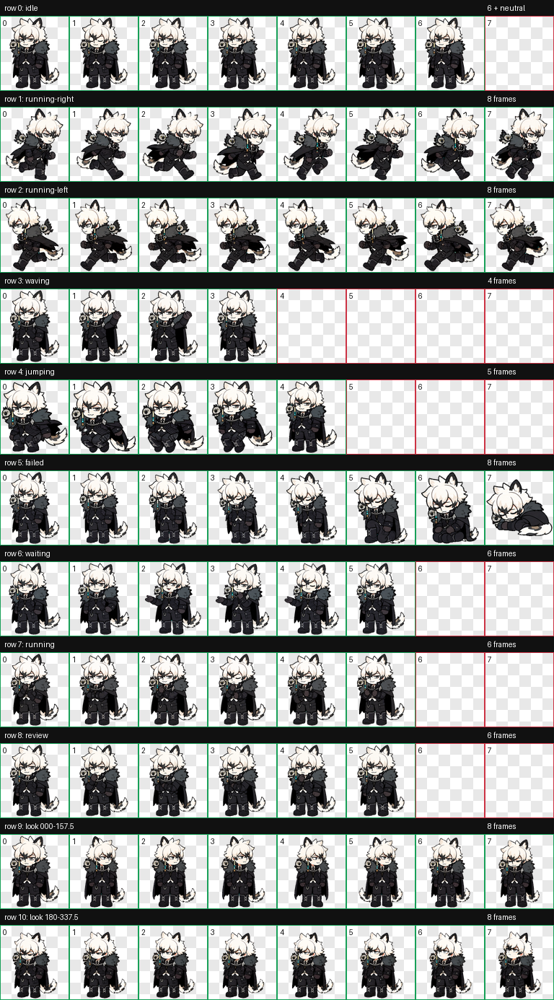
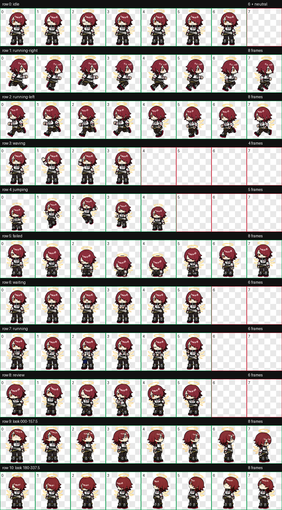
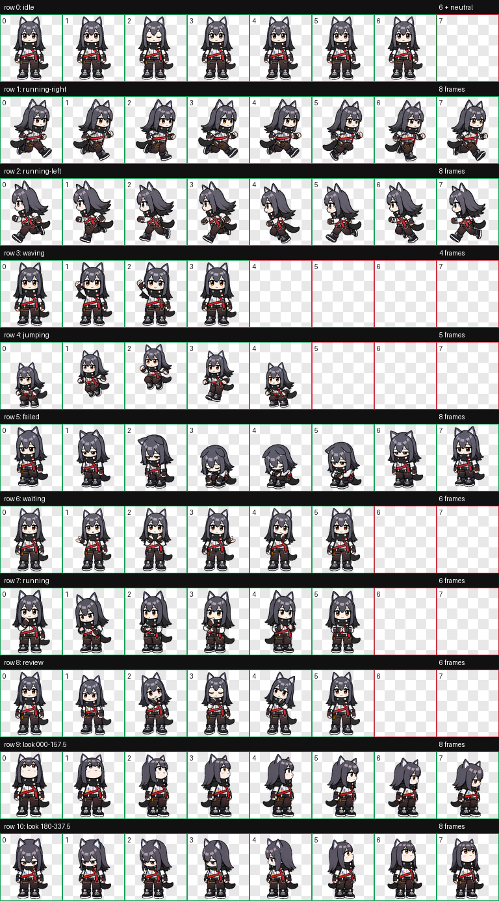

# Arknights Codex Pets



Seven unofficial, fan-made animated desktop pets for the Codex app. Each pet is packaged in the Codex V2 format with nine standard animation states and sixteen clockwise look directions.

## Included pets

| Pet | Display name | Package ID | Preview |
| --- | --- | --- | --- |
| Doctor Doctor | 博士士 | `doctor-doctor` | [Animation sheet](previews/contact-sheets/doctor-doctor.png) |
| Mimiko | 米米子 | `mimiko` | [Animation sheet](previews/contact-sheets/mimiko.png) |
| Kal'tsit-tan | 凯尔希炭 | `kaltsit-tan` | [Animation sheet](previews/contact-sheets/kaltsit-tan.png) |
| Vivimi | 维维美 | `weiweimei` | [Animation sheet](previews/contact-sheets/weiweimei.png) |
| Bright-Eyed SilverAsh | 靓眼银灰 | `liangyan-yinhui` | [Animation sheet](previews/contact-sheets/liangyan-yinhui.png) |
| Wandering Exusiai | 闲游能天使 | `xianyou-nengtianshi` | [Animation sheet](previews/contact-sheets/xianyou-nengtianshi.png) |
| Texas | 解闷德克萨斯 | `jiemen-dekesasi` | [Animation sheet](previews/contact-sheets/jiemen-dekesasi.png) |

## Quick installation

### Option 1: install all pets from a release archive

1. Download `arknights-codex-pets-v1.0.0.zip` from the [latest GitHub release](https://github.com/WangGroupFDU/arknights-codex-pets/releases/latest).
2. Extract the archive.
3. Run the installer for your platform.

macOS or Linux:

```bash
chmod +x install.sh
./install.sh
```

Windows PowerShell:

```powershell
Set-ExecutionPolicy -Scope Process Bypass
.\install.ps1
```

The installers copy every folder under `pets/` into `$CODEX_HOME/pets/`. If `CODEX_HOME` is not set, they use the default Codex data directory:

- macOS/Linux: `~/.codex/pets/`
- Windows: `%USERPROFILE%\.codex\pets\`

Fully quit and reopen Codex after installation so the custom-pet list is reloaded.

### Option 2: install one pet manually

Clone or extract this repository, then copy one complete pet folder into your Codex pets directory. Keep `pet.json` and `spritesheet.webp` together.

macOS or Linux example:

```bash
mkdir -p "${CODEX_HOME:-$HOME/.codex}/pets"
cp -R pets/kaltsit-tan "${CODEX_HOME:-$HOME/.codex}/pets/"
```

Windows PowerShell example:

```powershell
$CodexRoot = if ($env:CODEX_HOME) { $env:CODEX_HOME } else { Join-Path $HOME ".codex" }
New-Item -ItemType Directory -Force -Path (Join-Path $CodexRoot "pets") | Out-Null
Copy-Item -Recurse -Force .\pets\kaltsit-tan (Join-Path $CodexRoot "pets")
```

The installed layout should look like this:

```text
~/.codex/pets/kaltsit-tan/
├── pet.json
└── spritesheet.webp
```

## Updating or removing a pet

To update a pet, copy the newer `pet.json` and `spritesheet.webp` over the existing files, then restart Codex.

To remove a pet, delete only that pet's folder from the Codex pets directory. For example:

```bash
rm -rf "${CODEX_HOME:-$HOME/.codex}/pets/kaltsit-tan"
```

## Animation format

Every package uses `spriteVersionNumber: 2` and an RGBA WebP atlas with these properties:

- Atlas size: `1536 × 2288`
- Grid: `8 columns × 11 rows`
- Cell size: `192 × 208`
- Standard states: idle, move right, move left, wave, jump, failed, waiting, working, and review
- Look states: sixteen clockwise directions from `000°` through `337.5°`

All seven atlases were validated with the Hatch Pet V2 validator. Machine-readable reports are available in [`validation/`](validation/).

## Full previews

<details>
<summary>Doctor Doctor</summary>



</details>

<details>
<summary>Mimiko</summary>



</details>

<details>
<summary>Kal'tsit-tan</summary>



</details>

<details>
<summary>Vivimi</summary>



</details>

<details>
<summary>Bright-Eyed SilverAsh</summary>



</details>

<details>
<summary>Wandering Exusiai</summary>



</details>

<details>
<summary>Texas</summary>



</details>

## Troubleshooting

### The pets do not appear in Codex

Check that each pet has exactly one folder level beneath the `pets` directory. A common extraction mistake is creating an extra nested folder such as `pets/kaltsit-tan/kaltsit-tan/`.

Also confirm that:

- `pet.json` and `spritesheet.webp` are in the same directory.
- `pet.json` contains `"spriteVersionNumber": 2`.
- Codex was fully restarted after installation.
- `CODEX_HOME`, if set, points to the same Codex data directory used by the app.

### I only want one character

Download the matching individual ZIP from the GitHub release, or copy only that folder from `pets/`.

## Credits and disclaimer

The pet sprites were created with an AI-assisted OpenAI Codex ImageGen and Hatch Pet V2 workflow from user-provided character reference sheets.

This is an unofficial, non-commercial fan project. *Arknights* and all related characters, names, and original designs belong to Hypergryph and their respective publishers. This repository is not affiliated with or endorsed by Hypergryph, Yostar, OpenAI, or the Codex team. See [NOTICE.md](NOTICE.md) for the distribution notice.

